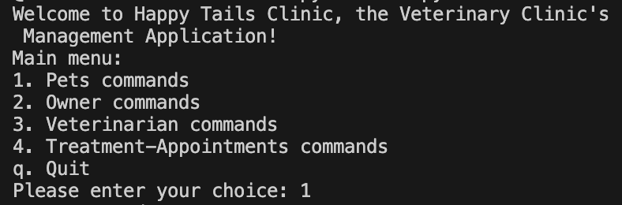
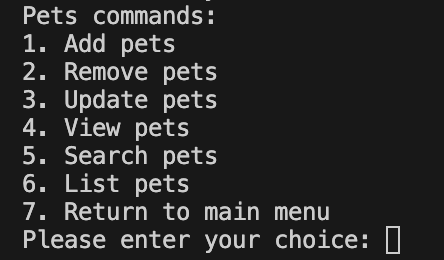
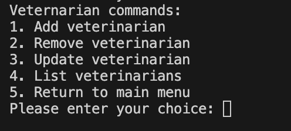
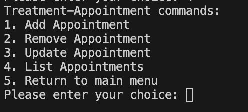

# Happy Tails Clinic - Phase 3 CLI Project

## Introduction
This is a CLI application that manages a pet care center's collection of pets, for use by veterinarians with the pet's owners.

## Installation
pipenv install

## Functionality/User Stories
As a user I am able to:

* Add new pets to the collection.
* Remove pets from the collection.
* Update details about a particular pet in the collection.
* Search for a pet based on various attributes (name, breed, illness, etc.)
* Display information about a particular pet.
* View a list of all pets.
* Track which veterinarian is using which pet, and with which owner.
* Add, update and delete appointment sessions.
* Add, update, and delete owners.
* View a list of all owners.
* Add, update, and delete veterinarians.
* View a list of all veterinarians.

## Model Structure for SQLite Database
The `models.py` file defines the model structure for the SQLite database using the SQLAlchemy ORM (Object Relational Mapping) in Python.

### Tables for Database

#### Pets Table
| Column | Description |
| --- | --- |
| ID | A unique identifier for each pet. |
| Name | The name of the pet. |
| Breed | The breed of the pet. |
| Illness | The illness or health condition of the pet. |
| Availability | Whether the pet is currently available or in use. |

#### Veterinarians Table
| Column | Description |
| --- | --- |
| ID | A unique identifier for each veterinarian. |
| Name | The name of the veterinarian. |
| Specialization | The veterinarian's area of specialization or expertise. |

#### Owners Table
| Column | Description |
| --- | --- |
| ID | A unique identifier for each owner. |
| Name | The name of the owner. |

#### Appointments Table
| Column | Description |
| --- | --- |
| ID | A unique identifier for each appointment record. |
| Pet ID | The ID of the pet being used. |
| Veterinarian ID | The ID of the veterinarian using the pet. |
| Owner ID | The ID of the owner with whom the pet is being used. |
| Start Date | The date and time when the appointment started. |
| End Date | The date and time when the appointment ended. |

## File Descriptions

### cli.py
This Python script defines a command-line interface (CLI) for the application. It uses the click library, a Python package that simplifies the creation of command line interfaces.  

### pets.py
This file defines a series of command-line interface (CLI) commands for managing pets.  

### owners.py
This file defines a series of command-line interface (CLI) commands for managing owners. 

### veterinarians.py
This file defines a series of command-line interface (CLI) commands for managing veterinarians. 

### appointments.py
This file defines a series of command-line interface (CLI) commands for managing appointments. 
 

## Author
Created by Maria Wanjiru

## License
MIT License

Copyright (c) [2024] Maria Wanjiru 

Permission is hereby granted, free of charge, to any person obtaining a copy of this software and associated documentation files (the "Software"), to deal in the Software without restriction, including without limitation the rights to use, copy, modify, merge, publish, distribute, sublicense, and/or sell copies of the Software, and to permit persons to whom the Software is furnished to do so, subject to the following conditions:

The above copyright notice and this permission notice shall be included in all copies or substantial portions of the Software.

THE SOFTWARE IS PROVIDED "AS IS", WITHOUT WARRANTY OF ANY KIND, EXPRESS OR IMPLIED, INCLUDING BUT NOT LIMITED TO THE WARRANTIES OF MERCHANTABILITY, FITNESS FOR A PARTICULAR PURPOSE AND NONINFRINGEMENT. IN NO EVENT SHALL THE AUTHORS OR COPYRIGHT HOLDERS BE LIABLE FOR ANY CLAIM, DAMAGES OR OTHER LIABILITY, WHETHER IN AN ACTION OF CONTRACT, TORT OR OTHERWISE, ARISING FROM, OUT OF OR IN CONNECTION WITH THE SOFTWARE OR THE USE OR OTHER DEALINGS IN THE SOFTWARE.