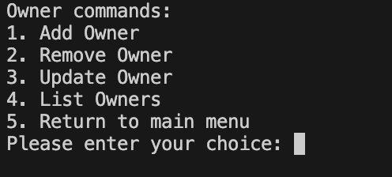

# Happy Tails Clinic - Phase 3 CLI Project

## Introduction
This is a CLI application that manages a pet care center's collection of pets, for use by veterinarians with the pet's owners.

## Installation
pipenv install

## Functionality/User Stories
As a user I am able to:

* Add new pets to the collection.
* Remove pets from the collection.
* Update details about a particular pet in the collection.
* Search for a pet based on various attributes (name, breed, illness, etc.)
* Display information about a particular pet.
* View a list of all pets.
* Track which veterinarian is using which pet, and with which owner.
* Add, update, and delete appointment sessions.
* Add, update, and delete owners.
* View a list of all owners.
* Add, update, and delete veterinarians.
* View a list of all veterinarians.

## Model Structure for SQLite Database

### Class Definitions

#### \`class Pet(Base)\`
This class represents a table in the database named 'pets'.

#### \`class Veterinarian(Base)\`
This class represents a table in the database named 'veterinarians'.

#### \`class Owner(Base)\`
This class represents a table in the database named 'owners'.

#### \`class Appointment(Base)\`
This class represents a table in the database named 'appointments'.

### Tables for Database

#### Pets Table
\| Column | Description |
\| --- | --- |
\| ID | A unique identifier for each pet. |
\| Name | The name of the pet. |
\| Illness | The illness or health condition of the pet. |
\| Availability | Whether the pet is currently available for appointment. |

#### Veterinarians Table
\| Column | Description |
\| --- | --- |
\| ID | A unique identifier for each veterinarian. |
\| Name | The name of the veterinarian. |
\| Specialization | The veterinarian's area of specialization or expertise. |

#### Owners Table
\| Column | Description |
\| --- | --- |
\| ID | A unique identifier for each owner. |
\| Name | The name of the owner. |

#### Appointments Table
\| Column | Description |
\| --- | --- |
\| ID | A unique identifier for each appointment record. |
\| Pet ID | The ID of the pet being used. |
\| Veterinarian ID | The ID of the veterinarian using the pet. |
\| Owner ID | The ID of the owner with whom the pet is being used. |
\| Start Date | The date and time when the appointment started. |
\| End Date | The date and time when the appointment ended. |

## File Descriptions

### \`cli.py\`
This Python script defines a command-line interface (CLI) for the application. It uses the click library, a Python package that simplifies the creation of command line interfaces.

- The script starts by importing the \`click\` module.
- It then imports commands from several modules: \`pets\`, \`owners\`, \`veterinarians\`, and \`appointments\`.
- The \`@click.group()\` decorator creates a new \`click.Group\` instance as the main command of the CLI.
- The docstring inside \`cli()\` provides a welcome message.
- Commands are added to the main \`cli\` command group using the \`add_command\` method.
- The script includes the idiom \`if __name__ == '__main__':\` to launch \`cli()\` when run directly.

### \`pets.py\`
This file defines CLI commands for managing pets using \`click\` and SQLAlchemy.

### \`owners.py\`
This file defines CLI commands for managing owners using \`click\` and SQLAlchemy.

### \`veterinarians.py\`
This file defines CLI commands for managing veterinarians using \`click\` and SQLAlchemy.

### \`appointments.py\`
This file defines CLI commands for managing appointments using \`click\` and SQLAlchemy.

## Author
Created by Maria Wanjiru

## License
MIT License
